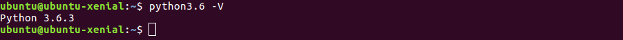

# Python

## Introducción a Python

Python es un **lenguaje de programación interpretado** que sigue los principios de legibilidad y transparencia, haciendo hincapié en una sintaxis que favorezca un **código legible**. Los lenguajes que siguen estos principios se dice que son "pythonicos", en contraposición con aquellos cuyo código es opaco u ofuscado, llamados "no pythonicos".

Python es un lenguaje de **código abierto**, **multiplataforma**, de **tipado dinámico** y **multiparadigma**, ya que soporta programación orientación a objetos, programación imperativa y, en menor medida, programación funcional. 


## Instalación de Python 3.6

Se puede instalar Python de varias formas. En este pequeño tutorial vamos a ver, concretamente, cómo instalar **Python 3.6** en **Ubuntu 16.04** descargándolo directamente del sitio web oficial y **compilándolo**.

Para ello deberemos actualizar la lista de paquetes disponibles de nuestra distribución de Ubuntu, instalar algunos paquetes necesarios, descargar los fuentes de Python del sitio oficial y, por último, compilarlo e instalarlo.

La secuencia de comandos necesaria para ello se muestra en el siguiente script:

```	

# Actualizar la lista de paquetes disponibles para Ubuntu
sudo apt-get update

# Instalar los pre-requisitos
sudo apt-get install build-essential checkinstall -y
sudo apt-get install libreadline-gplv2-dev libncursesw5-dev libssl-dev libsqlite3-dev tk-dev libgdbm-dev libc6-dev libbz2-dev -y

# Descargar Python desde el sitio web oficial
cd /usr/src
sudo wget https://www.python.org/ftp/python/3.6.3/Python-3.6.3.tgz

# Descomprimir el fichero descargado
sudo tar xzf Python-3.6.3.tgz

# Compilar e instalar Python 3.6.3
cd Python-3.6.3
sudo ./configure --enable-optimizations
sudo make altinstall


```

Durante la instalación se ha utilizado el parámetro _--enable-optimizations_ del comando _configure_ para habilitar el soporte de herramientas adicionales como SSL, bz2... 

También se ha empleado el parámetro _altinstall_ del comando _make_, para que la nueva instalación se realice sin sobrescribir la instalación preexistente. 


Una vez instalado podemos ver la versión exacta ejecutando el siguiente comando:
```
python3.6 -V
```


También podemos ver la versión del instalador de paquetes de Python:
```
pip3.6 -V
```


## Referencias y más información
- [Python.org](https://www.python.org/)
- [Documentación de Python3](https://docs.python.org/3/)
- [How to Install Python 3.6.3 on Ubuntu & LinuxMint ](https://tecadmin.net/install-python-3-6-ubuntu-linuxmint/#)
- [Python (wikipedia)](https://es.wikipedia.org/wiki/Python)
